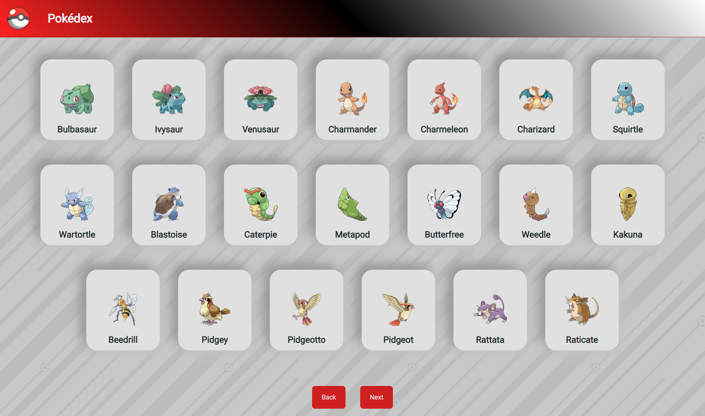

<h1 align="center">Pokédex</h1>

<p align="center">
  <a href="#-projeto">Projeto</a>&nbsp;&nbsp;&nbsp;|&nbsp;&nbsp;&nbsp;
  <a href="#-tecnologias">Tecnologias</a>&nbsp;&nbsp;&nbsp;|&nbsp;&nbsp;&nbsp;
  <a href="#%EF%B8%8F-instalando">Instalando</a>&nbsp;&nbsp;&nbsp;|&nbsp;&nbsp;&nbsp;
  <a href="#-licença">Licença</a>
</p>

<p align="center">
  <a href="#-license">
    
  </a>
</p>



## 💻 Projeto

Uma pokedex com todos os pokemons.

## ✨ Tecnologias

Esse projeto foi construido usando as seguintes tecnologias:

- [React](https://react.dev/)
- [Vite](https://vitejs.dev/)

## ▶️ Instalando

### WEB

É necessário ter o Node.

1. Clone este repositório:

```sh
git clone https://github.com/Claudao22/Pokedex.TS.git
```

2. Instale os pacotes:

```sh
npm install
```

3. Rode o servidor:

```sh
npm run dev
```

## 📝 Licença

Este projeto este projeto está sobre a MIT license. Veja o arquivo [LICENÇA](LICENSE.md) para mais detalhes.
